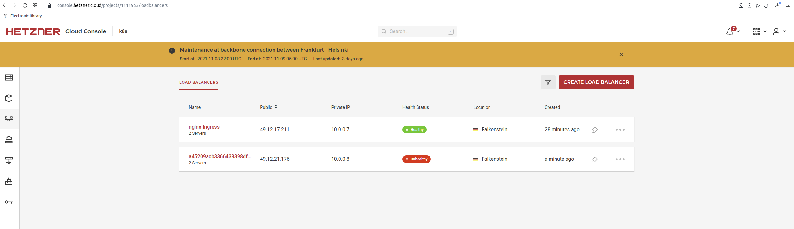

# k3s-hcloud (fedora)

[Hetzner Cloud](https://hetzner.com) is a good cloud provider that offers very affordable prices for cloud instances. The goal of this project was to create an optimal Kubernetes installation with it. We wanted functionality that was as close as possible to GKE's auto-pilot.

Here's what is working at the moment:

- Lightweight and resource-efficient Kubernetes with [k3s](https://github.com/k3s-io/k3s), and Fedora nodes to take advantage of the latest Linux kernels.
- Optimal [Cilium](https://github.com/cilium/cilium) CNI with full BPF support, and Kube-proxy replacement. It uses the Hetzner private subnet underneath to communicate between the nodes, as for the tunneling we use Geneve by default, but native routing also works.
- Automatic OS upgrades, supported by [kured](https://github.com/weaveworks/kured) that initiate a reboot of the node only when necessary and after having drained it properly.
- Automatic HA by setting the required number of servers and agents nodes.
- Automatic k3s upgrade by using Rancher's [system-upgrade-controller](https://github.com/rancher/system-upgrade-controller) and tracking the latest 1.x stable branch.
- Optional [Nginx ingress controller](https://kubernetes.github.io/ingress-nginx/) that will automatically use Hetzner's private network to allocate a Hetzner load balancer.

It uses Terraform to deploy as it's easy to use, and Hetzner provides a great [Hetzner Terraform Provider](https://registry.terraform.io/providers/hetznercloud/hcloud/latest/docs).

<!-- GETTING STARTED -->

## Getting started

Follow those simple steps and your world cheapest Kube cluster will be up and running in no time.

### Prerequisites

First and foremost, you need to have a Hetzner Cloud account. You can sign up for free [here](https://hetzner.com/cloud/).

Then you'll need you have both the [terraform](https://learn.hashicorp.com/tutorials/terraform/install-cli) and [helm](https://helm.sh/docs/intro/install/), and [kubectl](https://kubernetes.io/docs/tasks/tools/) cli installed. The easiest way is to use the [gofish](https://gofi.sh/#install) package manager to install them.

```sh
gofish install terraform
gofish install helm
gofish install kubectl
```

### Creating terraform.tfvars

1. Create a project in your Hetzner Cloud Console, and go to **Security > API Tokens** of that project to grab the API key.
2. Generate an ssh key pair for your cluster, unless you already have one that you'd like to use.
3. Rename terraform.tfvars.example to terraform.tfvars and replace the values from steps 1 and 2.

### Customize other variables (Optional)

The number of control plane nodes and worker nodes, and the Hetzner datacenter location, can be customized by adding the variables to your newly created terraform.tfvars file.

See the default values in the [variables.tf](variables.tf) file, they correspond to (you can copy-paste and customize):

```tfvars
servers_num = 2
agents_num = 2
location = "fsn1"
agent_server_type = "cx21"
control_plane_server_type = "cx11"
```

### Installation

```sh
terraform init
terraform apply -auto-approve
```

It will take a few minutes to complete, and then you should see a green output with the IP addresses of the nodes. Then you can immediately kubectl into it (using the kubeconfig.yaml saved to the project's directory after the install).

Just using the command `kubectl --kubeconfig kubeconfig.yaml` would work, but for more convenience, either create a symlink from `~/.kube/config` to `kubeconfig.yaml`, or add an export statement to your `~/.bashrc` or `~/.zshrc` file, as follows:

```sh
export KUBECONFIG=/<path-to>/kubeconfig.yaml
```

To get the path, of course, you could use the `pwd` command.

### Ingress Controller (Optional)

To have a complete and useful setup, it is ideal to have an ingress controller running and it turns out that the Hetzner Cloud Controller allows us to automatically deploy a Hetzner Load Balancer that can be used by the ingress controller. We have chosen to use the Nginx ingress controller that you can install with the following command:

```sh
helm repo add ingress-nginx https://kubernetes.github.io/ingress-nginx
helm repo update
helm install --values=manifests/helm/nginx/values.yaml ingress-nginx ingress-nginx/ingress-nginx -n kube-system
```

_Note that the default geographic location and instance type of the load balancer can be changed by editing the [values.yaml](manifests/helm/nginx/values.yaml) file._

<!-- USAGE EXAMPLES -->

## Usage

When the cluster is up and running, you can do whatever you wish with it. Enjoy! 🎉

### Useful commands

- List your nodes IPs, with either of those:

```sh
terraform outputs
hcloud server list
```

- See the Hetzner network config:

```sh
hcloud network describe k3s-net
```

- Log into one of your nodes (replace the location of your private key if needed):

```sh
ssh root@xxx.xxx.xxx.xxx -i ~/.ssh/id_ed25519 -o StrictHostKeyChecking=no
```

### Cilium commands

- Check the status of cilium with the following commands (get the cilium pod name first and replace it in the command):

```sh
kubectl -n kube-system exec --stdin --tty cilium-xxxx -- cilium status
kubectl -n kube-system exec --stdin --tty cilium-xxxx -- cilium status --verbose
```

- Monitor cluster traffic with:

```sh
kubectl -n kube-system exec --stdin --tty cilium-xxxx -- cilium monitor
```

- See the list of kube services with:

```sh
kubectl -n kube-system exec --stdin --tty cilium-xxxx -- cilium service list
```

_For more cilium commands, please refer to their corresponding [Documentation](https://docs.cilium.io/en/latest/cheatsheet)._

### Automatic upgrade

The nodes and k3s versions are configured to self-upgrade unless you turn that feature off.

- To turn OS upgrade off, log in to each node and issue:

```sh
systemctl disable --now dnf-automatic.timer
```

- To turn off k3s upgrade, use kubectl to set the k3s_upgrade label to false for each node (replace the node-name in the command):

```sh
kubectl label node node-name k3s_upgrade=false
```

### Individual components upgrade

To upgrade individual components, you can use the following commands:

- Hetzner CCM

```sh
kubectl apply -f https://raw.githubusercontent.com/mysticaltech/kube-hetzner/master/manifests/hcloud-ccm-net.yaml
```

- Hetzner CSI

```sh
kubectl apply -f https://raw.githubusercontent.com/hetznercloud/csi-driver/master/deploy/kubernetes/hcloud-csi.yml
```

- Rancher's system upgrade controller

```sh
kubectl apply -f https://raw.githubusercontent.com/rancher/system-upgrade-controller/master/manifests/system-upgrade-controller.yaml
```

- Kured (used to reboot the nodes after upgrading and draining them)

```sh
latest=$(curl -s https://api.github.com/repos/weaveworks/kured/releases | jq -r '.[0].tag_name')
kubectl apply -f https://github.com/weaveworks/kured/releases/download/$latest/kured-$latest-dockerhub.yaml
```

- Cilium and the Nginx ingress controller

```sh
helm repo update
helm upgrade --values=manifests/helm/cilium/values.yaml cilium cilium/cilium -n kube-system
helm upgrade --values=manifests/helm/nginx/values.yaml ingress-nginx ingress-nginx/ingress-nginx -n kube-system
```

## Takedown

If you chose to install the Nginx ingress controller, you need to delete it first to release the load balancer, as follows:

```sh
helm delete ingress-nginx -n kube-system
```

Then you can proceed to taking down the rest of the cluster with:

```sh
terraform destroy -auto-approve
```

Sometimes, the Hetzner network is still in use and refused to be deleted via terraform, in that case you can force delete it with:

```sh
hcloud network delete k3s-net
```

Also, if you had a full blown cluster in use, it's best do delete the whole project in your Hetzner account directly, as there may be other ressources created via operators that are not part of this project.


## Example

```
$ export HCLOUD_TOKEN="YOUR HETZNER TOKEN"
$ ssh-keygen -t ed25519 -C "your_email@example.com"

$ cat terraform.tfvars
hcloud_token = "XXXXXXXXXXXXXXXXXXXXXXXXXXXXXXXXXXXXXXXXXXXXXXXXX"
public_key   = "/home/davar/.ssh/id_ed25519.pub"
private_key  = "/home/davar/.ssh/id_ed25519"

$ terraform apply -auto-approve
...
Apply complete! Resources: 10 added, 0 changed, 0 destroyed.

Outputs:

agents_public_ip = [
  "23.88.124.208",
  "23.88.124.244",
]
controlplanes_public_ip = [
  "23.88.123.16",
  "49.12.5.242",
  "49.12.73.170",
]

$ ssh root@23.88.123.16

$ export KUBECONFIG=./kubeconfig.yaml
$ kubectl get node -o wide
NAME                  STATUS   ROLES                       AGE     VERSION        INTERNAL-IP   EXTERNAL-IP     OS-IMAGE                  KERNEL-VERSION            CONTAINER-RUNTIME
k3s-agent-0           Ready    <none>                      8m37s   v1.21.5+k3s2   10.0.0.5      23.88.124.208   Fedora 34 (Thirty Four)   5.14.16-201.fc34.x86_64   containerd://1.4.11-k3s1
k3s-agent-1           Ready    <none>                      7m      v1.21.5+k3s2   10.0.0.6      23.88.124.244   Fedora 34 (Thirty Four)   5.14.16-201.fc34.x86_64   containerd://1.4.11-k3s1
k3s-control-plane-0   Ready    control-plane,etcd,master   12m     v1.21.5+k3s2   10.0.0.2      23.88.123.16    Fedora 34 (Thirty Four)   5.14.16-201.fc34.x86_64   containerd://1.4.11-k3s1
k3s-control-plane-1   Ready    control-plane,etcd,master   6m45s   v1.21.5+k3s2   10.0.0.3      49.12.5.242     Fedora 34 (Thirty Four)   5.14.16-201.fc34.x86_64   containerd://1.4.11-k3s1
k3s-control-plane-2   Ready    control-plane,etcd,master   7m      v1.21.5+k3s2   10.0.0.4      49.12.73.170    Fedora 34 (Thirty Four)   5.14.16-201.fc34.x86_64   containerd://1.4.11-k3s1

$ helm install --values=manifests/helm/nginx/values.yaml ingress-nginx ingress-nginx/ingress-nginx -n kube-system

$ kubectl get all --all-namespaces
NAMESPACE        NAME                                                  READY   STATUS    RESTARTS   AGE
kube-system      pod/cilium-kjzvv                                      1/1     Running   0          9m13s
kube-system      pod/cilium-ktd5w                                      1/1     Running   0          13m
kube-system      pod/cilium-operator-687b9cbc9d-lqpvv                  1/1     Running   0          13m
kube-system      pod/cilium-operator-687b9cbc9d-v5g9c                  1/1     Running   0          13m
kube-system      pod/cilium-pfs97                                      1/1     Running   0          10m
kube-system      pod/cilium-qdlfr                                      1/1     Running   0          9m12s
kube-system      pod/cilium-sb9vr                                      1/1     Running   0          8m58s
kube-system      pod/coredns-7448499f4d-cbcd6                          1/1     Running   0          13m
kube-system      pod/hcloud-cloud-controller-manager-7db94b48f-jxpr8   1/1     Running   0          13m
kube-system      pod/hcloud-csi-controller-0                           5/5     Running   0          14m
kube-system      pod/hcloud-csi-node-5vq4m                             3/3     Running   0          9m13s
kube-system      pod/hcloud-csi-node-bvfrs                             3/3     Running   0          9m12s
kube-system      pod/hcloud-csi-node-d6qss                             3/3     Running   0          13m
kube-system      pod/hcloud-csi-node-r2486                             3/3     Running   0          8m58s
kube-system      pod/hcloud-csi-node-xlczv                             3/3     Running   0          10m
kube-system      pod/ingress-nginx-controller-5c8d66c76d-jx5r2         1/1     Running   0          35s
kube-system      pod/kured-czd5j                                       1/1     Running   0          8m53s
kube-system      pod/kured-dfl5c                                       1/1     Running   0          10m
kube-system      pod/kured-f2hqb                                       1/1     Running   0          13m
kube-system      pod/kured-jsdjz                                       1/1     Running   0          8m52s
kube-system      pod/kured-v79rs                                       1/1     Running   0          8m38s
kube-system      pod/metrics-server-86cbb8457f-skbch                   1/1     Running   0          13m
system-upgrade   pod/system-upgrade-controller-85b58fbc5f-mfgwf        1/1     Running   0          13m

NAMESPACE     NAME                                         TYPE           CLUSTER-IP      EXTERNAL-IP                                 PORT(S)                      AGE
default       service/kubernetes                           ClusterIP      10.43.0.1       <none>                                      443/TCP                      14m
kube-system   service/hcloud-csi-controller-metrics        ClusterIP      10.43.131.150   <none>                                      9189/TCP                     14m
kube-system   service/hcloud-csi-node-metrics              ClusterIP      10.43.148.14    <none>                                      9189/TCP                     14m
kube-system   service/ingress-nginx-controller             LoadBalancer   10.43.78.207    10.0.0.7,2a01:4f8:c011:b4::1,49.12.17.211   80:32368/TCP,443:30219/TCP   36s
kube-system   service/ingress-nginx-controller-admission   ClusterIP      10.43.38.114    <none>                                      443/TCP                      36s
kube-system   service/kube-dns                             ClusterIP      10.43.0.10      <none>                                      53/UDP,53/TCP,9153/TCP       14m
kube-system   service/metrics-server                       ClusterIP      10.43.195.56    <none>                                      443/TCP                      14m

NAMESPACE     NAME                             DESIRED   CURRENT   READY   UP-TO-DATE   AVAILABLE   NODE SELECTOR   AGE
kube-system   daemonset.apps/cilium            5         5         5       5            5           <none>          14m
kube-system   daemonset.apps/hcloud-csi-node   5         5         5       5            5           <none>          14m
kube-system   daemonset.apps/kured             5         5         5       5            5           <none>          14m

NAMESPACE        NAME                                              READY   UP-TO-DATE   AVAILABLE   AGE
kube-system      deployment.apps/cilium-operator                   2/2     2            2           14m
kube-system      deployment.apps/coredns                           1/1     1            1           14m
kube-system      deployment.apps/hcloud-cloud-controller-manager   1/1     1            1           14m
kube-system      deployment.apps/ingress-nginx-controller          1/1     1            1           35s
kube-system      deployment.apps/metrics-server                    1/1     1            1           14m
system-upgrade   deployment.apps/system-upgrade-controller         1/1     1            1           14m

NAMESPACE        NAME                                                        DESIRED   CURRENT   READY   AGE
kube-system      replicaset.apps/cilium-operator-687b9cbc9d                  2         2         2       14m
kube-system      replicaset.apps/coredns-7448499f4d                          1         1         1       14m
kube-system      replicaset.apps/hcloud-cloud-controller-manager-7db94b48f   1         1         1       14m
kube-system      replicaset.apps/ingress-nginx-controller-5c8d66c76d         1         1         1       35s
kube-system      replicaset.apps/metrics-server-86cbb8457f                   1         1         1       14m
system-upgrade   replicaset.apps/system-upgrade-controller-85b58fbc5f        1         1         1       14m

NAMESPACE     NAME                                     READY   AGE
kube-system   statefulset.apps/hcloud-csi-controller   1/1     14m

$ terraform output
agents_public_ip = [
  "23.88.124.208",
  "23.88.124.244",
]
controlplanes_public_ip = [
  "23.88.123.16",
  "49.12.5.242",
  "49.12.73.170",
]

$ hcloud server list
ID         NAME                  STATUS    IPV4            IPV6                     DATACENTER
15799374   k3s-control-plane-0   running   23.88.123.16    2a01:4f8:c17:79ed::/64   fsn1-dc14
15799417   k3s-control-plane-1   running   49.12.5.242     2a01:4f8:c17:695f::/64   fsn1-dc14
15799418   k3s-agent-0           running   23.88.124.208   2a01:4f8:c17:beca::/64   fsn1-dc14
15799419   k3s-agent-1           running   23.88.124.244   2a01:4f8:c17:e585::/64   fsn1-dc14
15799420   k3s-control-plane-2   running   49.12.73.170    2a01:4f8:c17:fa06::/64   fsn1-dc14


$ kubectl -n kube-system exec --stdin --tty cilium-kjzvv -- cilium monitor
$ kubectl -n kube-system exec --stdin --tty cilium-kjzvv -- cilium service list
$ kubectl -n kube-system exec --stdin --tty cilium-kjzvv -- cilium status --verbose

$ kubectl apply -f ./hello/hello-kubernetes-default.yaml 
deployment.apps/hello-kubernetes created
service/hello-kubernetes created
persistentvolumeclaim/csi-pvc created
$ kubectl get all
NAME                                    READY   STATUS    RESTARTS   AGE
pod/hello-kubernetes-6f8d7694bc-wvxqq   1/1     Running   0          68s

NAME                       TYPE           CLUSTER-IP     EXTERNAL-IP                                 PORT(S)          AGE
service/hello-kubernetes   LoadBalancer   10.43.117.10   10.0.0.8,2a01:4f8:c011:e6::1,49.12.21.176   8080:31498/TCP   68s
service/kubernetes         ClusterIP      10.43.0.1      <none>                                      443/TCP          34m

NAME                               READY   UP-TO-DATE   AVAILABLE   AGE
deployment.apps/hello-kubernetes   1/1     1            1           68s

NAME                                          DESIRED   CURRENT   READY   AGE
replicaset.apps/hello-kubernetes-6f8d7694bc   1         1         1       68s
```





```
Clean:
$ helm delete ingress-nginx -n kube-system
$ hcloud network delete k3s-net
$ terraform destroy -auto-approve


```


